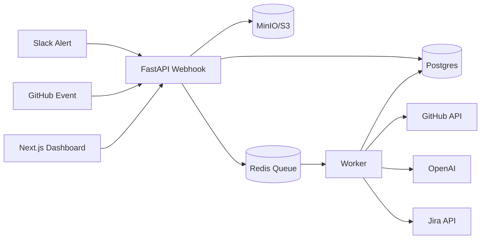
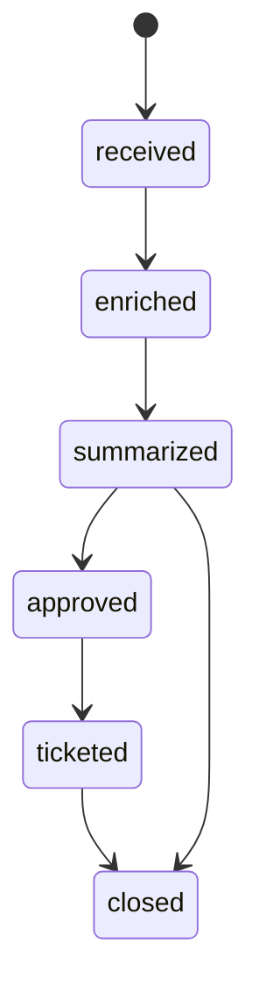
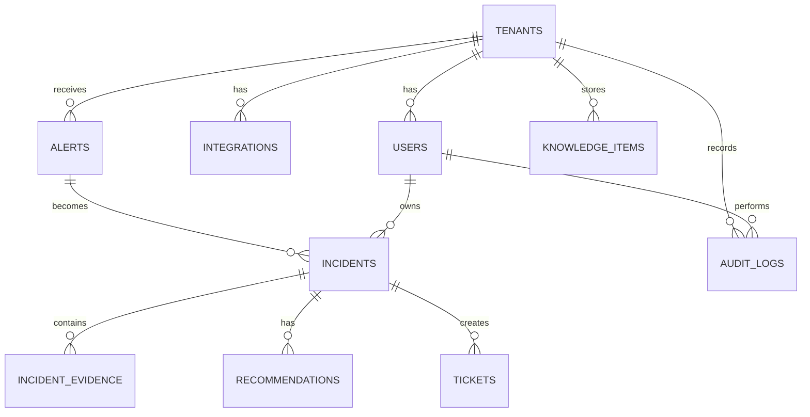

# Architecture

Security PR Copilot is split into a dashboard, an API, and a worker. The split keeps the UI responsive, keeps webhook handling short, and moves expensive enrichment and AI calls into auditable background jobs.

## Services

- `apps/web`: Next.js dashboard for incident review, approval, integrations, settings, and audit history.
- `services/api`: FastAPI service for auth, REST endpoints, webhook receivers, policies, and persistence.
- `services/worker`: RQ worker process that imports the API package and executes queue jobs.
- Postgres + pgvector: source of truth for tenants, incidents, tickets, audit logs, and knowledge items.
- Redis: queue broker for enrichment, analysis, scoring, and ticket jobs.
- MinIO/S3: raw webhook payloads and evidence snapshots.

## Data Flow

## Incident State Machine

## Trust Boundaries

- Webhook endpoints validate Slack/GitHub signatures before processing.
- JWT auth protects tenant data and app APIs.
- Tenant filters are applied at query boundaries.
- Risky external actions require explicit approval.
- All AI-generated recommendations and ticket creation actions produce audit log rows.

## Data Model

